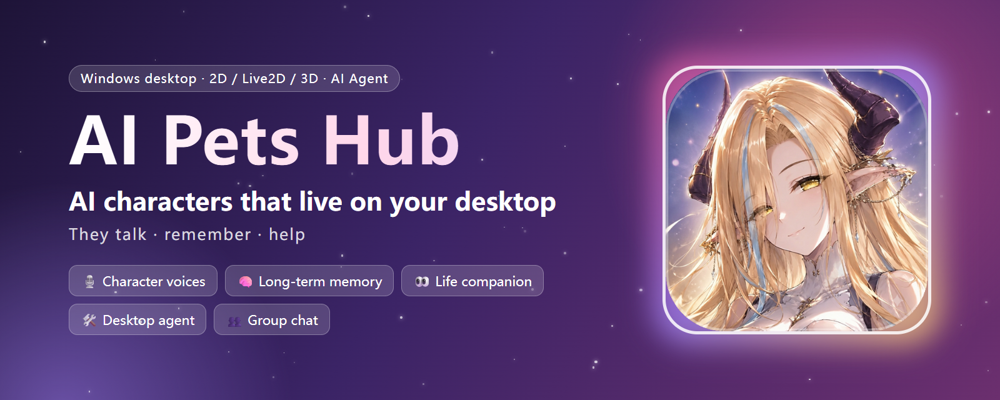
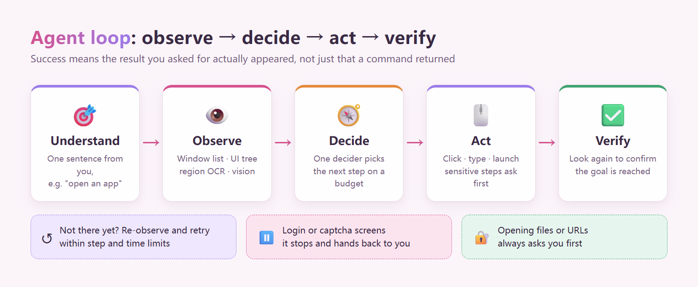
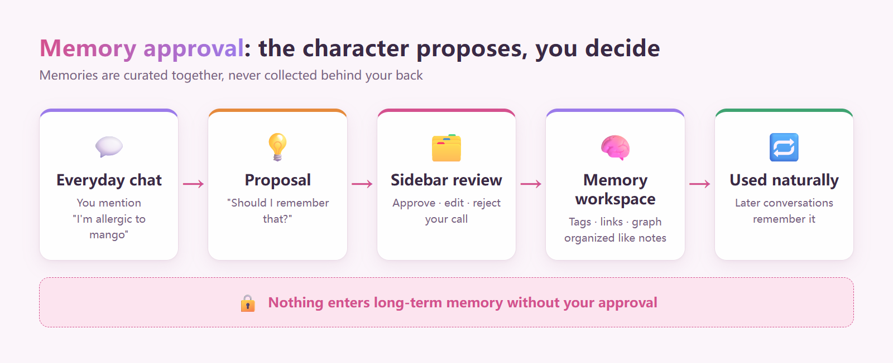
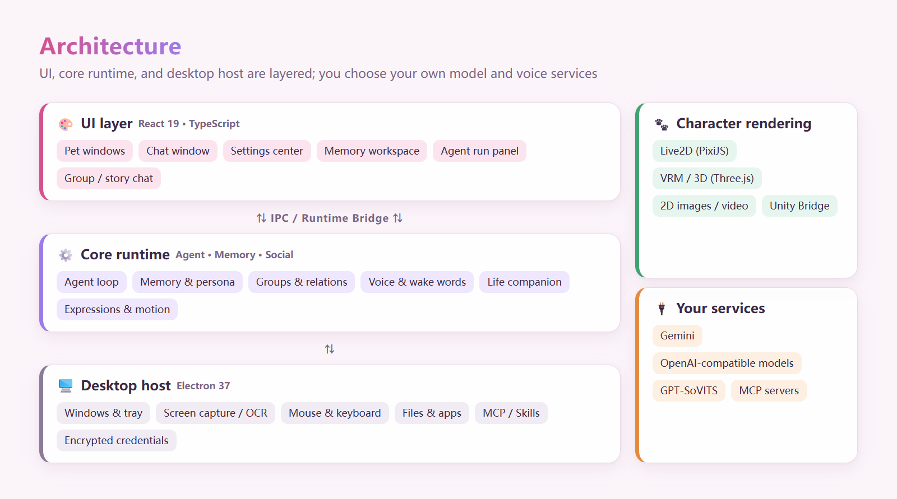

<p align="center">
  
</p>

<h1 align="center">AI Pets Hub</h1>

<p align="center">
  <a href="./README.zh-CN.md">简体中文</a> | <strong>English</strong>
</p>

<p align="center">
  
  
  
  <a href="https://github.com/JingXuan-Zun/AI-Pets-Hub-public/releases/latest"></a>
  <a href="./LICENSE"></a>
</p>

<p align="center">
  <a href="https://github.com/JingXuan-Zun/AI-Pets-Hub-public/releases/latest"><strong>⬇️ Download for Windows</strong></a> ・
  <a href="#quick-start">🚀 Quick start</a> ・
  <a href="#features">✨ Features</a> ・
  <a href="#contact">💌 Community</a>
</p>

**AI Pets Hub is an AI companion platform for the Windows desktop: your characters live on your screen, talk to you, remember you, and — when you allow it — help you operate your computer.**

> Built with Electron, React, and TypeScript. Put 2D image / video, Live2D, or VRM / 3D characters on your desktop;
> give each one its own personality, voice, wake words, and memories, then chat one-on-one, in a group, or play out a story.
> Memories are proposed by the character and saved only after you approve them, and screen watching starts only with your consent.
> A purpose-built observe → decide → act → verify agent loop lets characters actually open apps and work with on-screen UI for you.

---

## ✨ At a Glance

- 🐾 **Desktop companions** — Characters stay on your desktop: drag them around, watch them idle, move, and change expressions; run several at once
- 🎭 **Characters you design** — Each character has its own name, personality, system prompt, knowledge base, and look
- 💬 **Solo · group · story chat** — Talk with one character, let several chat together, or act out a story
- 🎙️ **Characters with real voices** — GPT-SoVITS voices with swappable voice packs; bind a different voice to each pet
- 👂 **Hands-free conversation** — Say a character's wake word and just talk; matching is by sound, so homophones still work
- 🧠 **They remember you** — Characters propose what to remember and save it only after you approve; organize it all in an Obsidian-style memory workspace
- 👀 **Life companion** — With your consent, a character notices what you're doing and checks in on you; disconnect with one click
- 🛠️ **Desktop agent** — Characters can open apps, click buttons, and read on-screen UI, asking first before sensitive steps
- 🔌 **Extensible** — Connect MCP tool servers and Skill packages; bring whichever model and voice services you like
- 🔐 **Privacy first** — API keys are encrypted on your machine; chats and memories stay on your own computer

---

## 🖼️ Preview

<!-- Screenshot to add: pet on the desktop + chat window (main preview, 1600px wide) -->

> 📸 App screenshots are on the way. Want to see it now? [Download the portable build](https://github.com/JingXuan-Zun/AI-Pets-Hub-public/releases/latest) and try it.

---

<a id="agent-loop"></a>

## ⚙️ The Agent Loop

> When a character operates your computer, it runs on a purpose-built desktop agent loop.
> Source: [`src/agent/loop/`](./src/agent/loop/)

<p align="center">
  
</p>

The key difference from "have the model emit a list of commands and run them" is that **after every step it looks at the screen again to confirm the result you asked for actually appeared**. A launch command returning success does not prove the right window opened; a task only counts as done once it is verified.

<details>
<summary><b>Design details</b> (click to expand)</summary>

- **One loop, one decider** — A single model decider picks the next step within a step and time budget, so multiple planners never fight each other.
- **Tiered observation** — It looks the cheap way first (window list, UI Automation tree), falls back to region OCR, and only then to a vision model; on-screen elements get numbered marks so the model can point at them precisely.
- **Task-scoped approval** — Clicks and typing can continue once you approve the task; opening files or URLs, steps that name a file path, and local project actions ask for fresh approval every time.
- **Verify after acting** — After each action it observes again to confirm the target state; if not reached, it recovers by re-locating or trying another way.
- **Knows when to stop** — On login or captcha screens that shouldn't be automated, it stops and hands control back to you.
- **A run panel you can watch** — A collapsible panel in the chat window shows what each step saw and did.
- **Safety boundaries** — Tool output is treated as data, never as instructions; agent file tools stay away from credentials and app data; IPC is trusted only from the bundled app page.

The new loop is on by default and can be turned off under **Settings → Agent**. It has been tested on only a few tasks so far, and file tasks still use the older path. See the [project overview](./docs/project-overview.en.md) for the full Agent Runtime.

</details>

---

<a id="quick-start"></a>

## 🚀 Quick Start

### Option 1: Download the portable build (recommended)

1. Open the [Releases page](https://github.com/JingXuan-Zun/AI-Pets-Hub-public/releases/latest) and download `AI-Desktop-Pet-<version>.exe`.
2. Double-click to run — no installer needed.
3. Fill in your model service as described in [First-run setup](#first-setup).

> [!NOTE]
> The app is not yet code-signed, so Windows SmartScreen may show a warning. Make sure the file came from this repository's Releases page before running it; you can also check it against the published SHA-256 file.

### Option 2: Run from source

**Requirements:** Windows 10 / 11 64-bit, [Node.js](https://nodejs.org/) 20 LTS or newer, npm, Git.

```powershell
git clone https://github.com/JingXuan-Zun/AI-Pets-Hub-public.git
cd AI-Pets-Hub-public
npm ci
npm run desktop
```

`npm run desktop` builds the UI and then launches the Electron desktop app. For UI-only work, use `npm run dev`.

<details>
<summary><b>Common development commands</b> (click to expand)</summary>

```powershell
npm run lint            # TypeScript type check
npm run build           # Build the UI
npm run smoke:agent:p0  # Focused agent smoke checks
npm run dist:win        # Build the Windows distribution
```

There are also check scripts for Agent, Neural Persona, MCP, Skills, and the desktop runtime; see [`package.json`](./package.json) for names and arguments.

</details>

---

<a id="first-setup"></a>

## 🔑 First-run Setup

After launch, open the **Settings center** and configure what you need:

1. **🤖 Model service** (required): pick Gemini or any OpenAI-compatible API and enter the API key, base URL, and model name. Chat and the agent both depend on it.
2. **🎭 Characters**: name your character, write its personality and system prompt, and import 2D / Live2D / 3D models and motions.
3. **🔊 Voice** (optional): choose browser speech, the OpenAI / Gemini speech APIs, or local GPT-SoVITS; pick a voice pack for each pet and set wake words.
4. **👀 Life companion / 🛠️ Agent** (optional): enable as you like — screen watching and desktop actions always ask for your consent first.

> [!TIP]
> API keys are encrypted with the operating system and stored only on your machine, never in the repository or the build. If encryption is unavailable, saving is refused rather than falling back to plain text.

---

<a id="features"></a>

## ✨ Features

### 🐾 Desktop Companions

<!-- Screenshot to add: pets on the desktop (several characters) -->

- **Many character formats** — 2D images / video, Live2D (PixiJS + Cubism), 3D models such as VRM / GLTF / GLB / FBX, plus a Unity runtime bridge.
- **Motion and expressions** — Idle, drag, click reactions, and emotional expressions are scheduled by one runtime; 2D video pets rotate through library folders and play clips matching the current emotion.
- **Several pets at once** — Place multiple characters on screen, each configured independently.
- **Separate windows** — Pets, chat, and settings are independent windows that share one state.

### 🎨 Pink Glass Theme

<!-- Screenshots to add: chat window + settings center (side by side) -->

A new pink glass look across the chat window and settings center, with standard window controls and a collapsible sidebar.

### 💬 Character Chat

- **Three modes** — Solo chat for one-on-one company; group chat where characters talk and reply to each other; story mode for playing out a scene.
- **Personality and knowledge** — Every character has its own name, personality, system prompt, knowledge base, and conversation context.
- **Long chats without forgetting** — History stays on your machine, and very long conversations get automatic summaries.
- **Your choice of model** — Gemini or any OpenAI-compatible API, with streaming replies and image input.

<!-- Screenshot to add: group chat -->

### 🧠 Memory and Persona

<p align="center">
  
</p>

- **Memory approval** — When something worth remembering comes up, the character asks "should I remember that?"; you approve, edit, or reject it in the sidebar. **Nothing enters long-term memory without your approval.**
- **Memory workspace** — Obsidian-style memory notes: drag to link, add tags, and browse the relationship graph, just like organizing notes.
- **Neural Persona** — Organizes a character's long-term information into a browsable, maintainable persona graph.
- **Groups and relationships** — Group memory, directed relationships between characters, and a social timeline lay the groundwork for characters living together.

<!-- Screenshots to add: memory workspace + approval sidebar -->

### 🔊 Voice

- **A voice for every character** — GPT-SoVITS support: lite voice packs need only a few reference recordings, trained packs sound closer to the original; each pet slot can use a different voice.
- **Many voice sources** — Browser speech, OpenAI / Gemini speech APIs, a local voice runtime, or GPT-SoVITS.
- **Hands-free conversation** — Just talk to your character; each one has its own wake words, matched by sound so misheard homophones still work.
- **Visible status** — Mic status appears under the character: "waiting for wake word" or "listening to you".
- **Smooth long replies** — Long replies are synthesized in complete sentence groups and played as they are ready.

See [`docs/voice-pack-format.md`](./docs/voice-pack-format.md) for the voice pack format.

<!-- Screenshot to add: voice pack settings / mic status -->

### 👀 Life Companion

- **Asks before looking** — When a character wants to know what you're doing, it asks first; screen watching starts only after you agree.
- **Disconnect anytime** — A disconnect button sits under the pet, and saying no in chat disconnects immediately.
- **Checks in on you** — Mood, affection, time of day, and quiet hours decide when it's a good moment to say something.

<!-- Screenshot to add: consent prompt / disconnect button -->

### 🛠️ Desktop Agent

- **Characters that can act** — Open apps, find and click buttons, and read window content for you.
- **A process you can see** — The run panel in chat records every observation and action.
- **Permissions you control** — Read-only observation and actions with side effects are handled separately; sensitive steps are confirmed one by one.

See [The Agent Loop](#agent-loop) above for how it works.

<!-- Screenshot to add: agent run panel -->

### 🔌 Extensions and Integrations

- **MCP** — Connect external MCP tool servers, with configuration, session pooling, health diagnostics, argument validation, and call policies built in.
- **Skills** — Import and manage Skill packages, with trust, signatures, update / rollback, and sandbox infrastructure.
- **Persona sharing** — Import or share reusable persona presets (requires a configured sharing service).
- **More runtimes** — Unity Bridge, DeepSeek Harness Bridge, and a ComfyUI Workflow settings entry.

---

## 🔐 Privacy and Security

- **Your data stays local** — Chat history, memories, character settings, and configuration are stored on your computer.
- **Encrypted credentials** — Model, search, and voice API keys are encrypted with Electron `safeStorage`; requests with saved model keys are made by the main process and the keys are not sent back to the UI.
- **New address, new key** — Changing a compatible API base URL requires re-entering the key, so a saved key is never forwarded to a new address.
- **You decide** — Screen watching, opening files and URLs, and local project actions all need your consent first.

<details>
<summary><b>More security details</b> (click to expand)</summary>

- Browser dev mode never writes API keys to `localStorage`; you re-enter them after reopening.
- Legacy desktop storage copies have credential fields cleared after a successful secure save or migration.
- Some request paths for search and voice credentials have not yet moved to the main process.
- Encrypted configuration is not a cross-device key backup.
- Please report security issues through GitHub private vulnerability reporting and avoid publishing exploitable details before a fix.

</details>

---

## 📊 Project Status

The project is in early public development: the core experience works, and some capabilities are still being polished.

| Module | Status | Notes |
| --- | :---: | --- |
| Desktop companions and windows | ✅ Ready | Pets, chat, and settings run independently and share state |
| Character chat (solo / group / story) | ✅ Ready | Requires your own model service |
| Memory approval and workspace | ✅ Ready | Deeper Neural Persona integration with chat is in progress |
| Voice and wake words | ✅ Ready | GPT-SoVITS must be installed separately and is slow on CPU |
| Life companion | 🧪 Preview | Screen watching needs your consent and can be disconnected anytime |
| Desktop agent | 🧪 Preview | The new loop has been tested on only a few tasks |
| 2D / Live2D / 3D characters | ⚙️ Needs assets | Runtimes are ready; bring your own models and motions |
| MCP / Skills | 🧪 Preview | Third-party compatibility varies by server |
| Unity Bridge / DeepSeek Harness / ComfyUI | ⚙️ Needs setup | Require their external runtimes |

<details>
<summary><b>Known issues and focus areas</b> (click to expand)</summary>

**Known issues**

- Cancelling an MCP tool during startup (first ~0.6 s) has no effect; resetting MCP on Windows may report "closed 0" even though sessions did close.
- "Voice playback failed" occasionally appears, possibly related to voice service key settings.
- App windows do not yet enable the sandbox or a CSP.
- The stop button for endless group chat still needs hands-on confirmation.

**Focus areas**

- Stabilize the agent's observe, act, verify, and recover path end to end.
- Let Neural Persona, long-term memory, and character relationships play a bigger part in everyday chat.
- Let characters share recent news, so each one knows what you have talked about with the others.
- Mature trust, sandboxing, and distribution for Skills and extensions.

</details>

---

## 🧱 Tech Stack

<p align="center">
  
</p>

| Layer | Technology |
| --- | --- |
| Desktop host | Electron 37 · Electron Builder |
| UI | React 19 · TypeScript 5.8 · Vite 6 |
| 2D / Live2D | PixiJS 6 · `pixi-live2d-display` · Cubism Core |
| 3D | Three.js · React Three Fiber · `@pixiv/three-vrm` |
| AI | Gemini · OpenAI-compatible APIs · in-house agent and MCP runtime |
| Voice | GPT-SoVITS · browser speech · OpenAI / Gemini speech APIs |

<details>
<summary><b>Project structure</b> (click to expand)</summary>

```text
electron/                 Electron main-process services and desktop integration
src/agent/                Agent sessions, planning, tools, execution, verification
src/agent/loop/           The observe → decide → act → verify desktop agent loop
src/pet-runtime/          2D / Live2D / 3D character runtimes
src/neural-memory/        Memory proposals, approval, and the memory workspace
src/character-graph/      Character graph and Neural Persona
src/life-companion/       Life companion
src/voice/                Speech synthesis, recognition, and wake words
src/social-group/         Group interaction
docs/                     Project overview, voice pack format, maintenance notes
scripts/                  Checks, builds, and maintenance scripts
```

This is a map of entry points; see the [project overview](./docs/project-overview.en.md) for the full module list.

</details>

---

## ⚠️ Disclaimer

- This project ships no AI models, voice models, or character assets; you provide your own and make sure you have the rights to use them.
- When using third-party model services, follow their terms; any charges are between you and the provider.
- The desktop agent operates your computer after you approve it. Use it for tasks you trust and pay attention to each confirmation prompt.
- The project is provided as is, without liability for any loss arising from its use.

---

## 📄 License

Project source code is licensed under the [PolyForm Noncommercial License 1.0.0](./LICENSE) (source-available, noncommercial).

| Use | Allowed? |
| --- | --- |
| Personal study, research, and private use | ✅ Free |
| Modifying the source and making your own version | ✅ Free (noncommercial) |
| Noncommercial sharing and redistribution | ✅ Free, with the license and copyright notices |
| Use by schools, charities, and public research organizations | ✅ Free |
| Commercial use (selling, paid services, company business use, ad revenue, bundling into commercial products, etc.) | ❌ Requires a separate commercial license |

**Commercial licensing:** contact us in QQ group **1082932504**.

This table is a summary for convenience; the [LICENSE](./LICENSE) text governs.

- Versions released before v0.2.0 (v0.1.0) were published under Apache-2.0, and that grant is unaffected by this change.
- The character illustration in the application icons is creator-owned and **excluded from the source license**. See [ASSET_LICENSES.md](./ASSET_LICENSES.md).
- Third-party dependencies and user-provided character models, animation, audio, and other assets remain subject to their own licenses; see [PUBLIC_EXPORT.md](./PUBLIC_EXPORT.md) for the scope of this public repository.

---

## 🤝 Contributing

Issues and pull requests are welcome! For larger changes, please open an issue to discuss first. When reporting a problem, please include:

- Your Windows version and the app version / commit
- Steps to reproduce, expected result, and actual result
- Relevant logs or screenshots (**remove API keys, tokens, personal paths, and chat content first**)
- For agent issues, the task description and the steps shown in the run panel

Please read the [privacy checklist](./docs/PUBLIC_PRIVACY_WORKFLOW.md) before contributing.

---

<a id="contact"></a>

## 💌 Community and Support

- 💬 **QQ group: 1082932504** (questions, feedback, and commercial licensing)
- 🐛 **Bug reports:** [GitHub Issues](https://github.com/JingXuan-Zun/AI-Pets-Hub-public/issues)

If this project makes your desktop a little warmer, a ⭐ Star means a lot to us!
