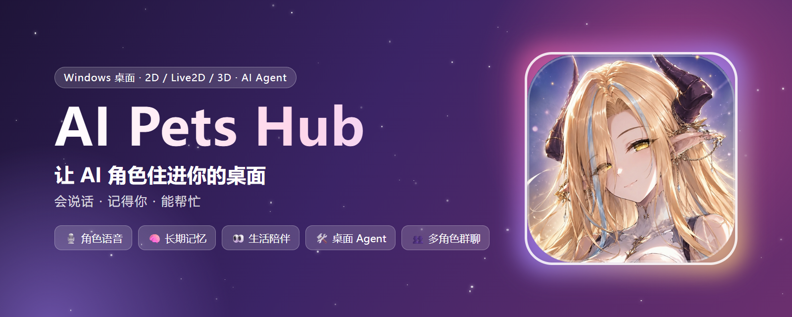
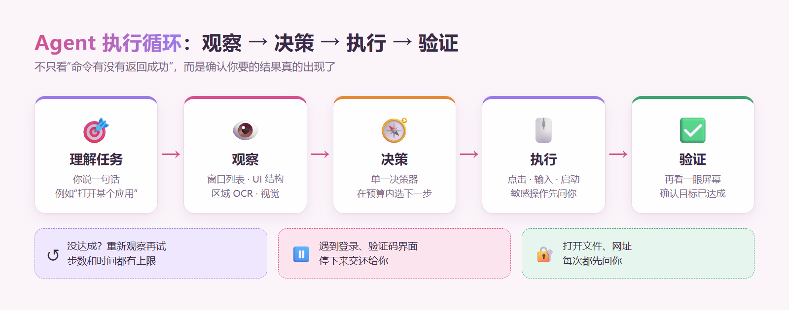
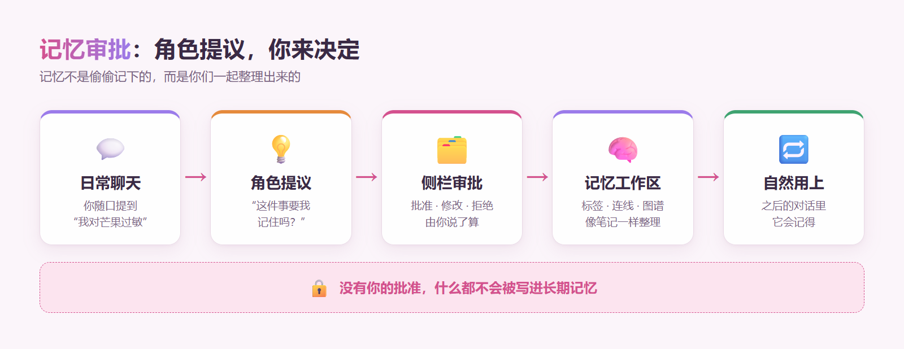
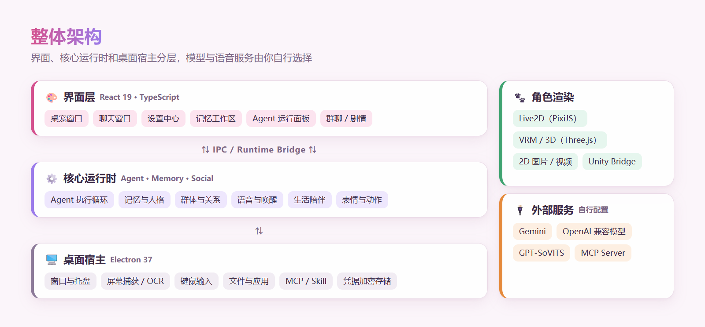

<p align="center">
  
</p>

<h1 align="center">AI Pets Hub</h1>

<p align="center">
  <strong>简体中文</strong> | <a href="./README.md">English</a>
</p>

<p align="center">
  
  
  
  <a href="https://github.com/JingXuan-Zun/AI-Pets-Hub-public/releases/latest"></a>
  <a href="./LICENSE"></a>
</p>

<p align="center">
  <a href="https://github.com/JingXuan-Zun/AI-Pets-Hub-public/releases/latest"><strong>⬇️ 下载 Windows 便携版</strong></a> ・
  <a href="#quick-start">🚀 快速开始</a> ・
  <a href="#features">✨ 功能</a> ・
  <a href="#contact">💌 加入交流群</a>
</p>

**AI Pets Hub 是一个运行在 Windows 桌面上的 AI 角色伴侣平台：让你的角色常驻桌面，会说话、记得你，还能在你允许时帮你操作电脑。**

> 基于 Electron + React + TypeScript 开发。2D 图片 / 视频、Live2D、VRM / 3D 角色都能放上桌面；
> 每个角色有自己的人格、声音、唤醒词和记忆，可以单聊、群聊或演一段剧情；
> 记忆由角色提议、经你批准才写入，屏幕观察也只在你同意后才开始；
> 自研的“观察 → 决策 → 执行 → 验证”Agent 循环，让角色能真正帮你打开应用、操作界面。

---

## ✨ 速览

- 🐾 **桌面陪伴** — 角色常驻桌面，可拖拽、待机、做动作、换表情；最多同时摆放多个桌宠
- 🎭 **你的角色，你来定** — 每个角色独立设置名字、人格、系统提示词、知识库和外观
- 💬 **单聊 · 群聊 · 剧情** — 和一个角色聊天，或让多个角色一起聊、一起演
- 🎙️ **会说话的角色** — GPT-SoVITS 角色语音，可换语音包；每个角色绑定自己的声音
- 👂 **免手动语音对话** — 喊出角色的唤醒词就能直接说话，按发音匹配，容错同音字
- 🧠 **记得你的事** — 角色提议要记住什么，你批准后才写入；在 Obsidian 风格的记忆工作区里整理
- 👀 **生活陪伴** — 经你同意后感知你在做什么，主动关心你；随时一键断开
- 🛠️ **桌面 Agent** — 让角色帮你打开应用、点按钮、读界面，敏感操作先征求你的同意
- 🔌 **可扩展** — 接入 MCP 工具服务器和 Skill 包；模型和语音服务由你自由选择
- 🔐 **隐私优先** — API Key 本机加密保存，聊天和记忆都留在你自己的电脑上

---

## 🖼️ 预览

<!-- 截图待补充：桌宠在桌面上 + 聊天窗口（主预览图，宽 1600px） -->

> 📸 应用界面截图正在整理中，很快补上。想先看看效果？可以直接[下载便携版](https://github.com/JingXuan-Zun/AI-Pets-Hub-public/releases/latest)体验。

---

<a id="agent-loop"></a>

## ⚙️ Agent 执行循环

> 角色帮你操作电脑时，跑的是自研的桌面 Agent 循环。
> 源码：[`src/agent/loop/`](./src/agent/loop/)

<p align="center">
  
</p>

它和“让模型吐出一串命令然后照做”最大的不同是：**每一步做完都会再看一眼屏幕，确认你要的结果真的出现了**。启动命令返回成功，不代表正确的窗口已经打开；只有验证通过，任务才算完成。

<details>
<summary><b>设计细节</b>（点击展开）</summary>

- **一个循环、一个决策者** — 单一模型决策器在步数和时间预算内选择下一步，避免多个规划器互相打架。
- **分层观察** — 先用开销小的方式看（窗口列表、UI Automation 结构），不够再用区域 OCR，最后才用视觉模型；界面元素会被编号标注，方便模型精确指认。
- **任务级授权** — 点击、输入这类操作在你授权任务后可连续执行；打开文件、打开网址、涉及文件路径的步骤和本地项目操作，每次都需要你重新确认。
- **执行后验证** — 操作完成后重新观察，确认目标状态；没达成会进入恢复流程，重新定位或换一种方式。
- **知道何时停下** — 遇到登录、验证码这类不该自动处理的界面，会停下来把控制权交还给你。
- **可观察的运行面板** — 聊天窗口里有折叠式运行面板，能看到每一步看到了什么、做了什么。
- **安全边界** — 模型拿到的工具输出被当作数据而不是指令；Agent 文件工具不会接触凭据和应用数据；只信任应用自带页面发来的 IPC。

新循环默认开启，可在 **设置 → Agent** 中关闭；目前只在少数任务上实测过，文件类任务仍走旧路径。更完整的 Agent Runtime 说明见[项目介绍](./docs/project-overview.zh-CN.md)。

</details>

---

<a id="quick-start"></a>

## 🚀 快速开始

### 方式一：下载便携版（推荐）

1. 打开 [Releases 页面](https://github.com/JingXuan-Zun/AI-Pets-Hub-public/releases/latest)，下载 `AI-Desktop-Pet-<版本号>.exe`。
2. 双击运行即可，无需安装。
3. 按下面的 [首次配置](#first-setup) 填好模型服务。

> [!NOTE]
> 应用暂未进行 Windows 代码签名，SmartScreen 可能弹出提示。请确认文件来自本仓库的 Releases 页面后再运行，也可以用发布页提供的 SHA-256 校验文件。

### 方式二：从源码运行

**前置条件：** Windows 10 / 11 64 位、[Node.js](https://nodejs.org/) 20 LTS 或更新版本、npm、Git。

```powershell
git clone https://github.com/JingXuan-Zun/AI-Pets-Hub-public.git
cd AI-Pets-Hub-public
npm ci
npm run desktop
```

`npm run desktop` 会先构建界面，再启动 Electron 桌面应用。只调试界面时可以用 `npm run dev`。

<details>
<summary><b>常用开发命令</b>（点击展开）</summary>

```powershell
npm run lint            # TypeScript 类型检查
npm run build           # 构建界面
npm run smoke:agent:p0  # Agent 核心冒烟检查
npm run dist:win        # 构建 Windows 分发版本
```

项目还提供按 Agent、Neural Persona、MCP、Skill 和桌面运行时划分的检查脚本，名称和参数以 [`package.json`](./package.json) 为准。

</details>

---

<a id="first-setup"></a>

## 🔑 首次配置

启动后打开 **设置中心**，按需完成以下配置：

1. **🤖 模型服务**（必需）：选择 Gemini 或任意 OpenAI 兼容接口，填写 API Key、接口地址和模型名称。这是角色聊天和 Agent 的基础。
2. **🎭 角色**：给角色起名字、写人格和系统提示词，导入 2D / Live2D / 3D 模型和动作资源。
3. **🔊 语音**（可选）：选择浏览器语音、OpenAI / Gemini 语音接口，或本地 GPT-SoVITS；在语音包页面为每个桌宠选一个声音，并设置唤醒词。
4. **👀 生活陪伴 / 🛠️ Agent**（可选）：按需开启；屏幕观察和桌面操作都会先征求你的同意。

> [!TIP]
> API Key 会用系统加密保存在本机，不会写进仓库或安装包；加密不可用时会拒绝保存，不会退回明文。

---

<a id="features"></a>

## ✨ 功能

### 🐾 桌面陪伴

<!-- 截图待补充：桌宠在桌面上（含多个角色） -->

- **多种角色形态** — 支持 2D 图片 / 视频、Live2D（PixiJS + Cubism）、VRM / GLTF / GLB / FBX 等 3D 模型，以及 Unity 运行时桥接。
- **动作与表情** — 待机、拖拽、点击互动和情绪表情由运行时统一调度；2D 视频桌宠可按文件夹轮播，并根据情绪播放对应片段。
- **多桌宠同屏** — 可以同时摆放多个角色，各自独立配置。
- **独立窗口** — 桌宠、聊天、设置中心互相独立，又共享同一份状态。

### 🎨 粉色玻璃主题

<!-- 截图待补充：聊天窗口 + 设置中心（两列并排） -->

全新的粉色玻璃风格界面，覆盖聊天窗口和设置中心；聊天和设置窗口使用标准窗口控件，侧栏可一键收起。

### 💬 角色聊天

- **三种模式** — 单聊专注一对一陪伴；群聊让多个角色一起说话、互相接话；剧情模式适合演绎一段故事。
- **人格与知识** — 每个角色有独立的名字、人格、系统提示词、知识库和对话上下文。
- **长对话不失忆** — 聊天记录保存在本机，超长对话会自动生成过往摘要。
- **自由选模型** — Gemini 和任意 OpenAI 兼容接口都可以用，支持流式回复和图片输入。

<!-- 截图待补充：群聊界面 -->

### 🧠 记忆与人格

<p align="center">
  
</p>

- **记忆审批** — 聊天中出现值得记住的事，角色会提出“要我记住吗？”；你在侧栏批准、修改或拒绝，**没有你的批准什么都不会写入长期记忆**。
- **记忆工作区** — Obsidian 风格的记忆笔记：拖拽连线、打标签、看关系图谱，像整理笔记一样整理你们的回忆。
- **神经人格（Neural Persona）** — 把角色的长期信息组织成可浏览、可维护的人格图谱。
- **群体与关系** — 群体记忆、角色之间的有向关系和社交时间线，为多角色共处打基础。

<!-- 截图待补充：记忆工作区 + 审批侧栏 -->

### 🔊 语音交互

- **角色专属声音** — 接入 GPT-SoVITS：轻量语音包只需几段参考录音，训练版语音包更接近原声；每个桌宠槽位可以绑定不同的声音。
- **多种语音来源** — 浏览器语音、OpenAI / Gemini 语音接口、本地语音运行时、GPT-SoVITS 任你选择。
- **免手动对话** — 开启后直接对角色说话；每个角色有自己的唤醒词，按发音匹配，听成同音字也能唤醒。
- **状态看得见** — 角色下方显示麦克风状态，“待唤醒”“正在听你说”一目了然。
- **长回复不卡顿** — 长回复按完整句子分组合成，边合成边播放。

语音包格式见 [`docs/voice-pack-format.md`](./docs/voice-pack-format.md)。

<!-- 截图待补充：语音包设置 / 麦克风状态 -->

### 👀 生活陪伴

- **先问再看** — 角色想了解你在做什么时会先征求同意；同意后才开始观察屏幕。
- **随时断开** — 桌宠下方有“断开”按钮，在聊天里说不要也会立即断开。
- **主动关心** — 结合心情、好感、时间和安静时段，在合适的时候主动搭话。

<!-- 截图待补充：同意提示 / 断开按钮 -->

### 🛠️ 桌面 Agent

- **能动手的角色** — 帮你打开应用、在界面里找到按钮并点击、读取窗口内容。
- **看得见的过程** — 聊天里的运行面板记录每一步观察和操作。
- **可控的权限** — 只读观察和有副作用的操作分开处理；敏感步骤逐次确认。

工作原理见上方的 [Agent 执行循环](#agent-loop)。

<!-- 截图待补充：Agent 运行面板 -->

### 🔌 扩展与集成

- **MCP** — 连接外部 MCP 工具服务器：配置、会话池、健康诊断、参数校验和调用策略都已内置。
- **Skill** — 导入和管理 Skill 包，带信任、签名、更新 / 回滚和沙箱相关基础设施。
- **人格分享** — 导入或分享可复用的人格预设（需要配置分享服务地址）。
- **更多运行时** — Unity Bridge、DeepSeek Harness Bridge 和 ComfyUI Workflow 设置入口。

---

## 🔐 隐私与安全

- **数据留在本机** — 聊天记录、记忆、角色设定和配置都保存在你的电脑上。
- **凭据加密** — 模型、搜索和语音的 API Key 用 Electron `safeStorage` 加密保存；已保存的模型密钥由主进程发起请求，不会回传到界面里。
- **改地址要重填** — 修改兼容接口地址后需要重新填写 API Key，不会把已保存的密钥转发给新地址。
- **你说了算** — 屏幕观察、打开文件和网址、本地项目操作都要先经过你的同意。

<details>
<summary><b>更多安全细节</b>（点击展开）</summary>

- 浏览器开发模式不会把 API Key 写入 `localStorage`，重新打开需要重新填写。
- 桌面旧存储副本在安全保存或迁移成功后会清除凭据字段。
- 搜索、语音等部分凭据的请求路径还没有全部迁到主进程。
- 加密配置不是跨设备的密钥备份。
- 安全问题请通过 GitHub 私密漏洞报告联系我们，在修复前请不要公开可利用细节。

</details>

---

## 📊 项目状态

项目处于早期公开开发阶段，核心体验已经可以使用，部分能力仍在打磨。

| 模块 | 状态 | 说明 |
| --- | :---: | --- |
| 桌面陪伴与多窗口 | ✅ 可用 | 桌宠、聊天、设置中心独立运行并共享状态 |
| 角色聊天（单聊 / 群聊 / 剧情） | ✅ 可用 | 需要自行配置模型服务 |
| 记忆审批与记忆工作区 | ✅ 可用 | 神经人格与对话的深度接合仍在推进 |
| 语音与唤醒词 | ✅ 可用 | GPT-SoVITS 需自行安装，CPU 上合成较慢 |
| 生活陪伴 | 🧪 预览 | 屏幕观察需要你的同意，可随时断开 |
| 桌面 Agent | 🧪 预览 | 新循环只在少数任务上实测过 |
| 2D / Live2D / 3D 角色 | ⚙️ 需素材 | 运行时已就绪，模型和动作需要自行准备 |
| MCP / Skill | 🧪 预览 | 第三方兼容性因服务而异 |
| Unity Bridge / DeepSeek Harness / ComfyUI | ⚙️ 需环境 | 需要对应的外部运行环境 |

<details>
<summary><b>已知问题与开发重点</b>（点击展开）</summary>

**已知问题**

- MCP 工具在启动阶段（约 0.6 秒内）取消无效；Windows 上重置 MCP 可能显示“关闭了 0 个”，但会话实际已关闭。
- 偶尔出现“语音播放失败”，可能与语音服务的密钥设置有关。
- 应用窗口尚未启用沙箱和 CSP。
- 群聊无限模式的停止按钮仍待实机确认。

**开发重点**

- 稳定 Agent 观察、执行、验证与恢复的端到端链路。
- 让神经人格、长期记忆和角色关系更深地参与日常对话。
- 角色之间互通近况，让多个角色“知道”彼此和你聊过什么。
- 完善 Skill / 扩展的信任、沙箱和分发流程。

</details>

---

## 🧱 技术栈

<p align="center">
  
</p>

| 层 | 技术 |
| --- | --- |
| 桌面宿主 | Electron 37 · Electron Builder |
| 界面 | React 19 · TypeScript 5.8 · Vite 6 |
| 2D / Live2D | PixiJS 6 · `pixi-live2d-display` · Cubism Core |
| 3D | Three.js · React Three Fiber · `@pixiv/three-vrm` |
| AI | Gemini · OpenAI 兼容接口 · 自研 Agent 与 MCP Runtime |
| 语音 | GPT-SoVITS · 浏览器语音 · OpenAI / Gemini 语音接口 |

<details>
<summary><b>项目结构</b>（点击展开）</summary>

```text
electron/                 Electron 主进程服务与桌面集成
src/agent/                Agent 会话、规划、工具、执行与验证
src/agent/loop/           观察 → 决策 → 执行 → 验证 桌面 Agent 循环
src/pet-runtime/          2D / Live2D / 3D 角色运行时
src/neural-memory/        记忆提议、审批与记忆工作区
src/character-graph/      角色图谱与 Neural Persona
src/life-companion/       生活陪伴
src/voice/                语音合成、识别与唤醒
src/social-group/         群体交互
docs/                     项目介绍、语音包格式与维护说明
scripts/                  检查、构建和维护脚本
```

目录只是入口索引，更完整的模块说明见[项目介绍](./docs/project-overview.zh-CN.md)。

</details>

---

## ⚠️ 免责声明

- 本项目不内置任何 AI 模型、语音模型或角色素材；你需要自行准备，并确认拥有相应授权。
- 使用第三方模型服务时，请遵守对应服务的条款；产生的费用由你与服务商结算。
- 桌面 Agent 会在你授权后操作你的电脑，请在信任的任务上使用，并留意每一步的确认提示。
- 本项目按“现状”提供，不对使用造成的任何损失承担责任。

---

## 📄 许可证

项目源码采用 [PolyForm Noncommercial License 1.0.0](./LICENSE)（源码公开、非商用许可）。

| 用途 | 是否允许 |
| --- | --- |
| 个人学习、研究、自用 | ✅ 免费 |
| 修改源码、做自己的版本 | ✅ 免费（非商业用途） |
| 非商业分享和再分发 | ✅ 免费，需附带许可证和版权声明 |
| 学校、公益组织、科研机构使用 | ✅ 免费 |
| 商业用途（售卖、付费服务、公司内部业务、广告变现、集成进商业产品等） | ❌ 需另行取得商业授权 |

**商业授权：** 请加 QQ 群 **1082932504** 联系我们。

上表是便于理解的摘要，具体以 [LICENSE](./LICENSE) 原文为准。

- v0.2.0 之前发布的版本（v0.1.0）按 Apache-2.0 发布，其授权不受本次变更影响。
- 应用图标中的角色插画由创作者保留权利，**不包含在源码许可范围内**；请阅读 [ASSET_LICENSES.md](./ASSET_LICENSES.md)。
- 第三方依赖、用户提供的角色模型 / 动画 / 音频及其他素材仍受各自许可约束；公开仓库的范围见 [PUBLIC_EXPORT.md](./PUBLIC_EXPORT.md)。

---

## 🤝 参与贡献

欢迎提交 Issue 和 Pull Request！较大的改动建议先开 Issue 讨论。反馈问题时请尽量附上：

- Windows 版本和应用版本 / commit
- 复现步骤、预期结果和实际结果
- 相关日志或截图（**先删除 API Key、Token、个人路径和聊天内容**）
- 如果涉及 Agent，附上任务描述和运行面板里的步骤

贡献前请先阅读[隐私检查流程](./docs/PUBLIC_PRIVACY_WORKFLOW.md)。

---

<a id="contact"></a>

## 💌 交流与支持

- 💬 **QQ 交流群：1082932504**（使用交流、问题反馈、商业授权都可以在群里联系）
- 🐛 **问题反馈：** [GitHub Issues](https://github.com/JingXuan-Zun/AI-Pets-Hub-public/issues)

如果这个项目让你的桌面多了一点温度，欢迎点一个 ⭐ Star 支持我们！
